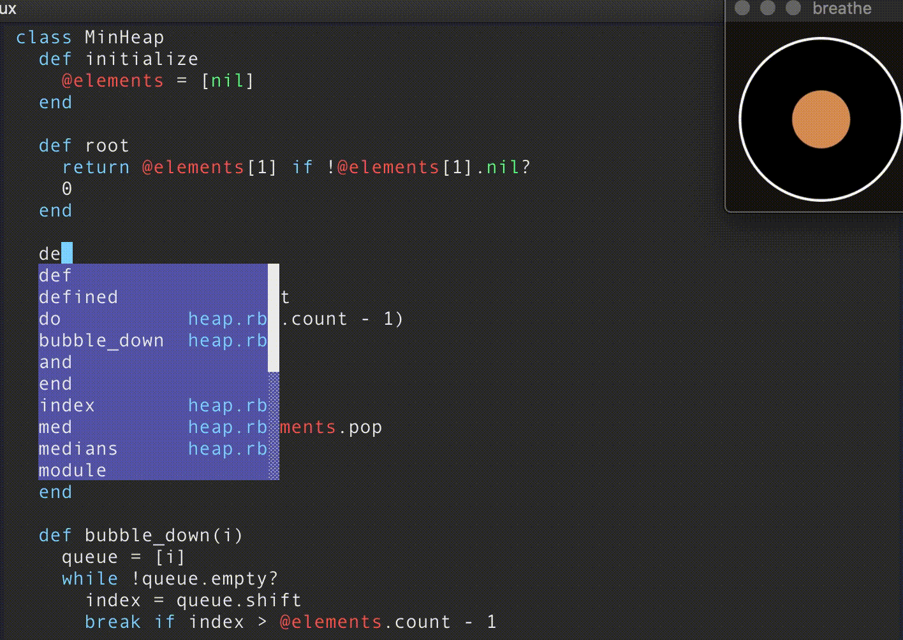

# breathe: distraction free peripheral breath trainer 💨💨

Breathe is a distraction free peripheral breath trainer, it helps you breathe correctly so you can stay calm and focus on what matters. Breathe's window is small and it always stays on top so you can look at it peripherally, while doing other stuff.

## Motivation
I did this 5 minute project after reading some articles on how breathing correctly can help you focus and can calm you. I don't expect this to work for everyone but it does indeed work for me. Some of the articles:
- https://news.ycombinator.com/item?id=13508038
- https://news.ycombinator.com/item?id=23271572
- https://news.ycombinator.com/item?id=23962638

## Installation

You can download the app [here](https://github.com/filipeisho/breathe/releases).

## Contributing

Feel free to Contribute to this project!

## Credits

-   [Filippo Facioni](https://github.com/filipeisho)

## License

The MIT License (MIT).
